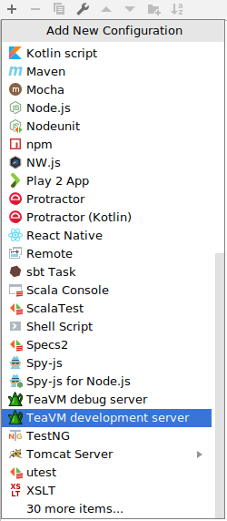

Installing TeaVM plugin
-----------------------

In menu choose *File* -> *Settings*, then choose *Plugins* item in the dialog.
Press *Browse repositories* button and find TeaVM plugin in the list.
After you install TeaVM and restart IDEA, you are ready to create a project.

Creating a project
------------------

Create a new project from terminal using Maven archetype, as described in [Getting started](/docs/intro/getting-started.html) section.

If everything went OK, your project should look like this:

Deploying to Tomcat
-------------------

If you are developing a full stack web application, you may want to deploy your application to servlet container (for example, Tomcat)

Pick *Run* -> *Edit configurations...* from the main menu.
Push *plus* button and choose *Tomcat Server* -> *Local*.

Open *Deployment* tab of a newly created launch configuration and add a new artifact
to the *Deploy at the server startup* list.
Choose *exploded* artifact.
Change application context to '/'.

Now run your launch configuration.
IDEA automatically opens browser with your application.
If everything is ok, you should see a blank page.
TeaVM is still not configured, so there's no script that runs our logic.

TeaVM development server
------------------------

To run TeaVM from IDEA, you can create a TeaVM development server.

Pick *Run* -> *Edit configurations...* from the main menu.
Push *plus* button and choose *TeaVM development server*.

Change following options:

* **Main class** to your project's main class.
* **Path to file** to `teavm`.
* **Proxy URL** to `http://localhost:8080`.

Now run this launch configuration and open `http://localhost:9090`.
You should see DOM content generated with your Java code.

As you change the code and press 'Build' button, development server
detects changed automatically and rebuilds your application,
so you don't need to perform additional actions to update generated JavaScript.
Simply press 'Refresh' button in the browser.

How it works
------------

Development server is a small HTTP server that runs embedded TeaVM compiler inside.
This compiler generates JavaScript in memory and serves it from the path you specified in settings.
Additionally, the script may interact with the resources served by application server,
which is on another address.
To make these resources available to the script, development server also can act as a proxy
server.
Since we set *Proxy URL* to URL of application server, `index.html` becomes available from
`http://localhost:9090/index.html`.
It tries to load `/teavm/classes.js` file, which resolves to `http://localhost:9090/teavm/classes.js`.
The latter resource is generated with TeaVM compiler.

Debugging Java code
-------------------

If you use Chrome, you can debug your Java code right from IDEA.
You need to install [additional plugin](https://chrome.google.com/webstore/detail/teavm-debugger-agent/jmfipnkacgdmdhapfciejmfgfhfonfgl).
Simply launch development server with *Debug* button instead of *Run* button and
open `http://localhost:9090/index.html` in Chrome.
Development server and Chrome plugin should detect each other and you'll see following
indicator in Chrome:

Now you can put breakpoints in Java code and refresh page.