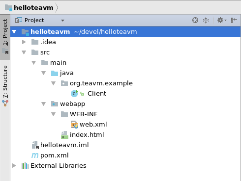

Installing TeaVM plugin
-----------------------

In menu choose *File* -> *Settings*, then choose *Plugins* item in the dialog.
Press *Browse repositories* button and find TeaVM plugin in the list.
After you install TeaVM and restart IDEA, you are ready to create a project.


Creating a project
------------------

Create a new project from terminal using Maven archetype, as described in [Getting started](/docs/intro/getting-started.html) section.

If everything went OK, your project should look like this:




Building the project
--------------------

Simply click `Build Project` button (or press Ctrl+F9).
IDEA will run the build.
After build completes, you can find generated JavaScript files in `target/generated/js/teavm` folder.
Edit your code and press `Build Project` button again, IDEA will update the JS file.


Deploying to Tomcat
-------------------

If you are developing a full stack web application, you may want to deploy your application to servlet container (for example, Tomcat)

Pick *Run* -> *Edit configurations...* from the main menu.
Push *plus* button and choose *Tomcat Server* -> *Local*.
Open *Deployment* tab of a newly created launch configuration and add a new artifact
to the *Deploy at the server startup* list.
Please, choose *exploded* artifact.

Now run your launch configuration.
IDEA automatically opens browser with your application.
If everything is ok, you should see the text: `TeaVM generated element`.


Doing some server logic
-----------------------

Create the `Server` class in the corresponding package with following content

```java
package my.pkg.name;

import java.io.IOException;

import javax.servlet.ServletException;
import javax.servlet.annotation.WebServlet;
import javax.servlet.http.HttpServlet;
import javax.servlet.http.HttpServletRequest;
import javax.servlet.http.HttpServletResponse;

@WebServlet("/hello")
public class Server extends HttpServlet {
    private static final long serialVersionUID = 1L;

    @Override
    protected void doGet(HttpServletRequest req, HttpServletResponse resp) throws ServletException, IOException {
        try {
            Thread.sleep(500);
        } catch (InterruptedException e) {
            return;
        }
        String userAgent = req.getHeader("User-Agent");
        resp.getWriter().write("Hello, " + userAgent);
    }
}
```

In the *Run* tool window push *Update application* button and choose 
*Redeploy* action.
Follow `http://localhost:8080/hello` in the browser.
If you saw the greeting message, everything is ok.


Interacting with the server
---------------------------

Now you are ready to modify your application to send request to server and receive response.
First, open `index.html` file modify its content:

```html
<!DOCTYPE html>
<html>
  <head>
    <title>Hello web application</title>
    <meta http-equiv="Content-Type" content="text/html;charset=utf-8">
    <script type="text/javascript" charset="utf-8" src="teavm/runtime.js"></script>
    <script type="text/javascript" charset="utf-8" src="teavm/classes.js"></script>
  </head>
  <body onload="main()">
    <div><button id="hello-button">Hello, server</button></div>
    <div id="hello-panel"></div>
    <div id="thinking-panel" style="display:none"><i>Server is thinking...</i></div>
    <div id="response-panel"></div>
  </body>
</html>
```

Second, add some TeaVM logic in the `Client` class:

```java
package my.pkg.name;

import org.teavm.jso.ajax.XMLHttpRequest;
import org.teavm.jso.dom.html.HTMLButtonElement;
import org.teavm.jso.dom.html.HTMLDocument;
import org.teavm.jso.dom.html.HTMLElement;

public class Client {
    private static HTMLDocument document = HTMLDocument.current();
    private static HTMLButtonElement helloButton = document.getElementById("hello-button").cast();
    private static HTMLElement responsePanel = document.getElementById("response-panel");
    private static HTMLElement thinkingPanel = document.getElementById("thinking-panel");

    private Client() {
    }

    public static void main(String[] args) {
        helloButton.listenClick(evt -> sayHello());
    }

    private static void sayHello() {
        helloButton.setDisabled(true);
        thinkingPanel.getStyle().setProperty("display", "");
        XMLHttpRequest xhr = XMLHttpRequest.create();
        xhr.onComplete(() -> {
            responsePanel.appendChild(document.createElement("div").withText(xhr.getResponseText()));
            helloButton.setDisabled(false);
            thinkingPanel.getStyle().setProperty("display", "none");
        });
        xhr.open("GET", "hello");
        xhr.send();
    }
}
```

Again, push *Update application* button and follow to the browser which should now
show your application with working button.
